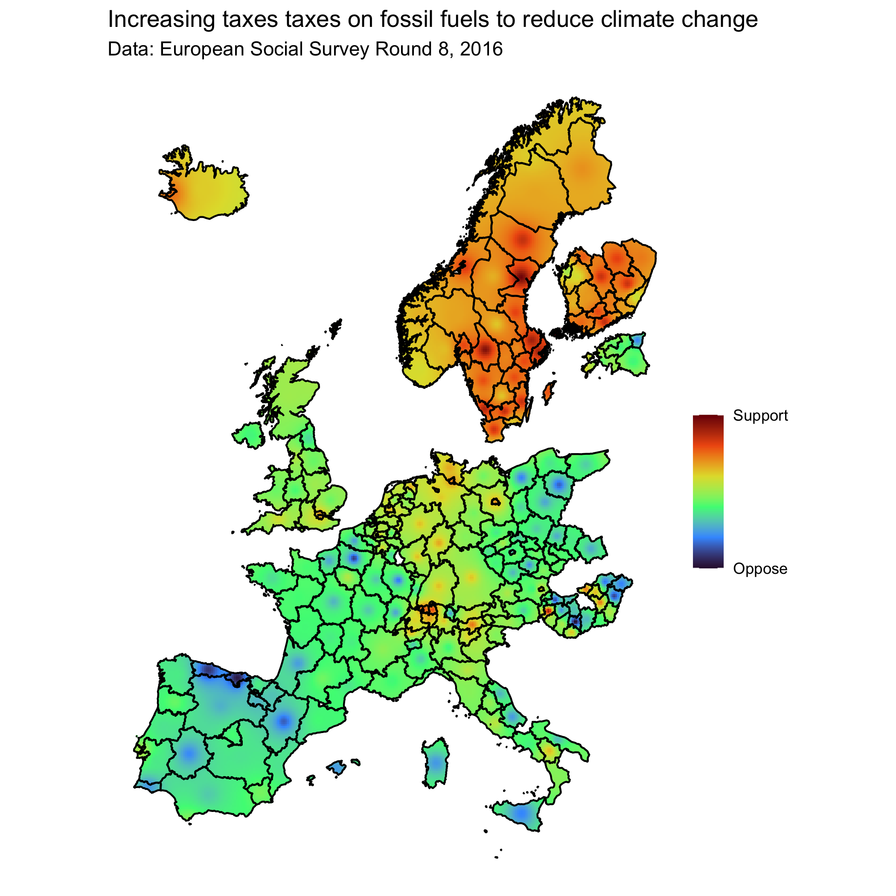

# README

An example of how to plot survey-weighted statistics onto a map, using inverse distance weighted interpolation to show subnational variation.

## Sources

The survey data come from Round 8 (2016) of the [European Social Survey][ess].

[ess]: https://www.europeansocialsurvey.org/

The full survey question for the example follows:

> To what extent are you in favour or against the following policies in [country] to reduce climate change? __Increasing taxes on fossil fuels, such as oil, gas and coal.__  
> 1 -- Strongly in favour  
> 2 -- Somewhat in favour  
> 3 -- Neither in favour nor against  
> 4 -- Somewhat against  
> 5 -- Strongly against

The shapefiles used were released by [EuroGeographics][egs] in 2016 and were fetched [from Eurostat][shp].

[egs]: https://eurogeographics.org/
[shp]: https://ec.europa.eu/eurostat/web/gisco/geodata/reference-data/administrative-units-statistical-units

The code is freely adapted from Edzer Pebesma and Roger Bivand's _[Spatial Data Science][rspatial]_ (2023), ch. 12 (["Spatial Interpolation"][rspatial12]), and from Anthony Damico's ["How to map the European Social Survey"][damico15] (2015), who goes further than we do by using a more complex interpolation method and by correcting small area statistics.

[rspatial]: https://r-spatial.org/book/
[rspatial12]: https://r-spatial.org/book/12-Interpolation.html
[damico15]: https://github.com/davidbrae/swmap/blob/master/how%20to%20map%20the%20european%20social%20survey.R

### R code to generate the `ESS8e02_2_extract` dataset

```r
# nothing fancy happening here
haven::read_dta("ESS8e02_2.dta/ESS8e02_2.dta") %>%
    select(cntry, region, regunit, idno, pspwght, inctxff) %>%
    readr::write_tsv("data/ESS8e02_2_extract.tsv")
```

## End result (and others maps)

The final product of the script is not as detailed as what Anthony produced (see [this archived blog post](https://www.r-bloggers.com/2014/12/maps-and-the-art-of-survey-weighted-maintenance/)), but is decent enough:
  



For even cooler maps of the sort, see ["Isarithmic Maps of Public Opinion Data"](https://dsparks.wordpress.com/2011/10/24/isarithmic-maps-of-public-opinion-data/) by David B. Sparks, who sadly never released the code to produce that brilliant encoding of local density into alpha transparency.
