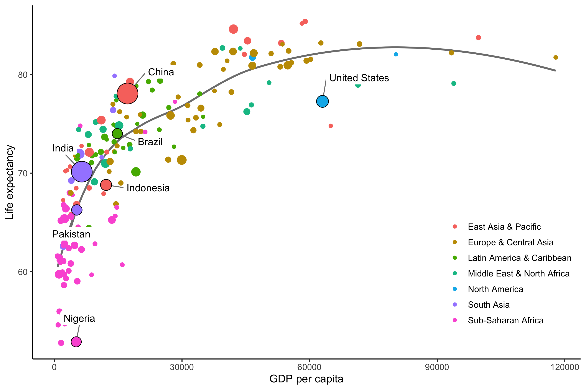

# DSR: Exercise 4

This exercise focuses on

- making use of code that was distributed to you earlier
- exploring the many options of the [`ggplot2`][ggplot2] package
- finding help online when required

This is _not_ an easy exercise: work with your group, and get ready to spend a couple of hours on it.

## Scenario

You are interning at the [World Bank][wb], and have been asked to plot the most recent version of the [Preston curve][preston].

[wb]: https://www.worldbank.org/en/home
[preston]: https://en.wikipedia.org/wiki/Preston_curve

A previous intern has left you some code, which is included in this folder, as well as a plot showing the expected result. However, the code to reproduce the plot, which is also reproduced below, is actually missing from the script.

## Instructions

Execute and fill in the script to get as close as possible to the expected result.

Hints:

- Everything except the text labels happens with the `ggplot2` package. Check its [online documentation][ggplot2] as much as needed.
- The text labels are the hard part to get. They are produced by using the `ggrepel` package: read [its vignette][ggrepel], and see if you can manage something close enough to the expected result.
- The expected result uses the 'classic' `ggplot2` theme (`?theme_classic`), with a base text size of `12` points.
- The size of the data points in the expected result range from `1.5` to `10.5`. Use `scale_size_continuous` to specify that range.

[ggplot2]: https://ggplot2.tidyverse.org/
[ggrepel]: https://cran.r-project.org/web/packages/ggrepel/vignettes/ggrepel.html

## Expected result

